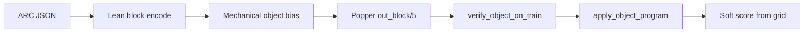

<!-- 2df9a982-46b9-4f74-aa81-09a3795bb483 -->
---
name: Object-only solver
overview: "Strip ladder, dual, and pixel-head induction; keep only block_primary object-head flow."
isProject: true
todos:
  - id: git-bootstrap
    content: "Clean-tree gate; branch feature/object-only-solver from develop (or main if develop stale)"
    status: completed
  - id: tdd-contracts
    content: "Write/rewrite failing object-only contract tests BEFORE production deletes"
    status: completed
  - id: pipeline-object-only
    content: "Green: thin pipeline.solve object-head only; drop ladder/pixel/trivial"
    status: completed
  - id: encode-bias-delete
    content: "Green: lean encode + object bias only; delete dual/pixel modules and static biases"
    status: completed
  - id: harness-cli-scripts
    content: "Green: harness/CLI/scripts block_primary-only"
    status: completed
  - id: docs-archive
    content: "docs: living docs object-only; SOLVER_PLAN obsolete banner"
    status: in_progress
  - id: local-verify
    content: "pytest + harness one-shot + smoke_solver locally"
    status: pending
  - id: baseline-regression
    content: "Pre/post: JOBS=4 block_primary timeout=120 trials 0,1,2 — measured 37/54; expected 39/54 had mismatches"
    status: completed
---

# Object-only solver (remove ladder / dual / pixel)

Canonical workspace copy under [`.cursor/plans/`](.) — plans live here by default.

## Goal

Align the code with [`.cursor/rules/block-level-only.mdc`](../rules/block-level-only.mdc): **one** mechanical object path (`out_block/5` → decode → score). Delete ladder, dual, pixel-head ILP, and trivials.

**Keep (not solvers):** pixel decode, soft score via materialized `out/3` from the predicted grid ([solver/paper_score.py](../../solver/paper_score.py)).



## Skills applied ([`.agents/skills/`](../../.agents/skills/))

| Skill | How it shapes this plan |
|-------|-------------------------|
| [tdd-workflow](../../.agents/skills/tdd-workflow/SKILL.md) | Contract tests **before** deleting production paths; AAA; behavior over implementation details |
| [coding-standards](../../.agents/skills/coding-standards/SKILL.md) | **YAGNI**: delete flags/modes, do not leave dead `include_pixels`; **KISS**: thin `solve`; early returns; no speculative “maybe keep dual behind a flag” |
| [git-workflow](../../.agents/skills/git-workflow/git-workflow.md) | Branch `feature/object-only-solver` off `develop`; Conventional Commits; PR → `develop` (no direct `main`) |
| [backend-patterns](../../.agents/skills/backend-patterns/SKILL.md) | Treat `pipeline.solve` as thin orchestration; encode = data emit; bias_gen = pure transform; induce/verify/decode = steps — no mega-function ladder |
| [security-review](../../.agents/skills/security-review/SKILL.md) | Light: keep writing only under caller `work_dir`; do not expand path trust; no secrets in commits |
| NestJS project-guidelines / api-versioning | **N/A** (wrong stack) — skip |
| continuous-learning | After merge: optional extract “object-only strip” pattern if reusable |

Also honor workspace [plan-implementation](../rules/plan-implementation.mdc): clean tree before coding; **one Conventional Commit per step** below.

## Rules compliance

| Rule (`block-level-only`) | Plan |
|---------------------------|------|
| Induce only at `out_block` | Sole path |
| Decode → pixels for scoring | Keep |
| Uniform mechanical exs/bk/bias | Preserve lean encode + `render_object_bias_from_bk`; **do not** change allowlist/guards |
| No trivials / hybrid `block_ilp` / pixel–dual ladder | **Delete** |
| No marker/reflect / answer leak | Out of scope; do not touch |
| vs pixel Decom | **External** Decom only (`raw_data/onedarcraw`); no in-solver `pixel_only` |

**Fallback:** copy test input; `level=fallback_identity`; empty program; `verified_train=False`; `confidence=low`. Not an `object_ilp` win (distinct from forbidden trivial solvers).

**Static `bias/object.pl`:** tests/emergency only; runtime always uses per-instance `bias_object.pl`.

## Defaults

- Harness: `--mode` choices = `["block_primary"]` only (keep flag for JSON compatibility).
- Delete alternate solvers entirely (YAGNI — no feature flags).
- Docs: update living docs; banner [docs/SOLVER_PLAN.md](../../docs/SOLVER_PLAN.md) as archive.
- No SPEC in this repo.
- **Plan files live under `.cursor/plans/` by default.**

## Regression baseline (exact pass counts)

Pre-change and post-change acceptance for `block_primary`, trials `0,1,2`, timeout **120s**, **JOBS=4**:

```bash
OUT=results/solver/baseline_block_primary_120 \
JOBS=4 DELAY=5 \
./scripts/run_solver_eval_parallel.sh block_primary 120 0,1,2
```

Expected per-category exact pass (folder names are `1d_<category>`). Live verify status (**final**, `JOBS=4`, timeout `120`, trials `0,1,2`):

| Category | Expected | Got | Status |
|----------|----------|-----|--------|
| denoising_1c | 3/3 | 3/3 | MATCH |
| denoising_mc | 3/3 | 3/3 | MATCH |
| fill | 3/3 | 3/3 | MATCH |
| flip | 1/3 | 0/3 | MISMATCH (−1) |
| hollow | 0/3 | 0/3 | MATCH |
| mirror | 1/3 | 2/3 | MISMATCH (+1) |
| move_1p | 3/3 | 3/3 | MATCH |
| move_2p | 3/3 | 3/3 | MATCH |
| move_2p_dp | 3/3 | 3/3 | MATCH |
| move_3p | 3/3 | 3/3 | MATCH |
| move_dp | 3/3 | 3/3 | MATCH |
| padded_fill | 2/3 | 0/3 | MISMATCH (−2) |
| pcopy_1c | 0/3 | 0/3 | MATCH |
| pcopy_mc | 0/3 | 0/3 | MATCH |
| recolor_cmp | 3/3 | 3/3 | MATCH |
| recolor_cnt | 3/3 | 2/3 | MISMATCH (−1) |
| recolor_oe | 2/3 | 3/3 | MISMATCH (+1) |
| scale_dp | 3/3 | 3/3 | MATCH |

**Final:** 54/54 done; exact **37/54** vs expected **39/54**. Results under `results/solver/baseline_block_primary_120/block_primary/`. Baseline is **not** locked to the expected matrix until mismatches are explained or the expected table is revised to the measured **got** column.

Measured-as-truth alternative (if we adopt this run as the regression gate): same table’s **Got** column, total **37/54**.

Object-only cleanup must not regress whichever matrix we lock.

## Implementation workflow (on approval)

### Step 0 — Git bootstrap

```bash
git status   # must be clean for solver work
# Untracked .agents/ and new .cursor/rules/*: leave alone or commit separately first
# so they do not mix into this feature.
git fetch origin
git checkout develop && git pull origin develop
git checkout -b feature/object-only-solver
```

If `develop` is behind / unused for this repo’s recent work, confirm with user once, then base off `main` but still name `feature/object-only-solver`.

Commit style (every later step):

```text
refactor(solver): <imperative summary>

<body why>
```

### Step 1 — TDD contracts first (red)

Add/rewrite tests in [solver/tests/](../../solver/tests/) **before** production deletes. Prefer behavior assertions:

1. **`test_pipeline_object_only.py` (new)**  
   - `solve(..., timeout=1)` on a tiny fixture: kwargs must not accept `ladder` / `force_bias` / `include_pixels` (TypeError or removed from signature).  
   - Result `level` ∈ `{object_ilp, fallback_identity}` only (never `pixel_ilp`, `dual_ilp`, `block_ilp`, trivial names).  
   - Fallback never has `verified_train=True`.

2. **Rewrite [solver/tests/test_encoder.py](../../solver/tests/test_encoder.py)**  
   - Encode emits lean typed BK; no `pixel_block` / `in(`/`empty(` pixel facts; has `out_block` exs + `bias_object.pl`.  
   - No `exs_pixel_path` / train pixel `exs.pl` for learning.  
   - Drop tests for `render_bias(2|3)`, `_pixel_only_bias`, dual parity.

3. **Bias**  
   - `render_object_bias_from_bk` still mechanical; assert no `head_pred(out,3)`.  
   - Prefer testing public API only (avoid ImportError-as-test for deleted helpers).

4. **Harness**  
   - `MODES` / CLI: only `block_primary`; unknown mode rejected.

Run `pytest solver/tests -q` — expect failures until later steps green them.

Commit: `test(solver): lock object-only contracts before ladder removal`

### Step 2 — Thin pipeline (green)

Rewrite [solver/pipeline.py](../../solver/pipeline.py) (KISS / early return):

- Signature: `solve(instance, *, timeout, work_dir=None)` only.
- Encode lean → induce object → `verify_object_on_train` → `apply_object_program` → soft score.
- No `write_bias_files`, `try_trivial`, pixel verify/apply.
- Fallback as specified above.

Commit: `refactor(solver): collapse pipeline to object-head only`

### Step 3 — Encode + bias + delete pixel modules (green)

- [solver/encoder.py](../../solver/encoder.py): always lean typed-roles; drop pixel/dual flags and non-lean branches; keep `test.pl` `out/3` for soft score only.
- [solver/predicates.py](../../solver/predicates.py) / [solver/bias_gen.py](../../solver/bias_gen.py): object inventory only; delete ladder 2/3 helpers and static pixel/dual/block `.pl`.
- Delete [solver/trivial.py](../../solver/trivial.py), unused [solver/colors.py](../../solver/colors.py); strip pixel `apply_program` / `verify_on_train` from [solver/verify.py](../../solver/verify.py).

Commit: `refactor(solver): strip pixel dual encode bias and trivials`

### Step 4 — Harness / CLI / scripts (green)

- [solver/harness.py](../../solver/harness.py), [solver/cli.py](../../solver/cli.py), [scripts/](../../scripts/): `block_primary` only; smoke uses object path.

Commit: `refactor(solver): make harness and CLI object-only`

### Step 5 — Docs (green)

- Update [README.md](../../README.md), [docs/CURRENT_METHOD.md](../../docs/CURRENT_METHOD.md), [solver/README.md](../../solver/README.md), [docs/ILP-1D-Method.md](../../docs/ILP-1D-Method.md).
- Banner on [docs/SOLVER_PLAN.md](../../docs/SOLVER_PLAN.md).

Commit: `docs: document object-only solver as sole path`

### Step 6 — Local verify + PR

```bash
pytest solver/tests -q
python -m solver.harness --timeout 60 --one \
  raw_data/onedarcraw/dataset/1d_denoising_1c/1d_denoising_1c_0.json
./scripts/smoke_solver.sh
```

Then (git-workflow): push `feature/object-only-solver`, `gh pr create` → **`develop`**, title `refactor(solver): remove ladder dual and pixel solvers`.

## Out of scope

- Popper tree; external Decom baselines.
- Allowlist / mechanical bias algorithm / connectivity guards.
- Marker/reflect or answer-leaking BK.
- Re-adding in-solver `pixel_only`.
- NestJS/api-versioning patterns from example skills.
