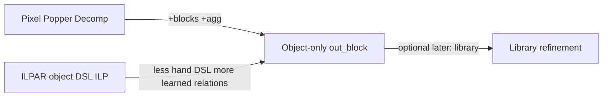

# ILP Method for Generic 1D-ARC

Landscape note + how this repo’s **object-only** path sits among ILP work.
As-built: [CURRENT_METHOD.md](CURRENT_METHOD.md). Method plan:
[SOLVER_PLAN.md](SOLVER_PLAN.md). Direction:
[`.cursor/rules/block-level-only.mdc`](../.cursor/rules/block-level-only.mdc).

Scope: **ILP-only lineage** (no LLM program search, no pure neural TTT).

---

## 1. What recent ILP work actually did

### A. Relational Decomposition + Popper (Hocquette & Cropper, IJCAI 2025)
- **Idea:** Decompose I/O into facts; learn `out(...)` from `in(...)` with
  off-the-shelf Popper.
- **1D-ARC BK:** pixels + `empty` + arithmetic; deliberately **no** object
  operators.
- **Result:** ~59/63/69% at 1/10/60 min on 1D-ARC (vs ARGA ~94% with object DSL).
- **Strengths:** Domain-light; interpretable; exact few-shot induction.
- **Weaknesses:** Pixel BK forces long clauses; weak on objects/counting; no
  cross-task library.

### B. ILPAR — ILP over object DSL (Rocha et al., 2024/2025)
- **Idea:** Sequence of ILP tasks that **generate output objects** into an empty
  grid, using a hand-designed object-centric DSL as BK.
- **Strengths:** Objects-first; FOL fits relations; criticizes pixel-Popper as
  limiting.
- **Weaknesses:** Fixed DSL prior; not a full 1D-ARC (900) competitor; risk of
  developer-aware generalization.

### C. Adjacent symbolic baselines
- **ARGA:** Graph objects + DSL search — ~94% on 1D-ARC (not ILP).
- **Undecomposed ILP baselines:** ~0% — representation is the bottleneck.

### D. This repo (object-only / `block_primary`)
- **Idea:** Per-instance Popper; **block** facts only for induction; head
  `out_block/5`; mechanical object bias from the instance; paint-verify; decode
  to pixels for metrics.
- **Strengths vs A:** Objects + aggregations without leaving ILP.
- **Strengths vs B:** Learned relations over blocks; no hand transform operators;
  full-benchmark harness.
- **Limits:** No cross-task library yet; single segmentation prior (maximal
  same-color runs); no pixel-head rescue (by design — see block-level-only).

---

## 2. Strength / weakness matrix (ILP line)

| Method | Representation | What ILP learns | Prior in BK | Main gap |
|--------|----------------|-----------------|-------------|----------|
| Pixel relational decomp | pixels | `out` pixel rules | arithmetic | no objects/count |
| ILPAR | objects + DSL | object-generating LPs | rich object DSL | DSL completeness; scale |
| This repo | blocks + aggs | `out_block/5` | segmentation + aggs (no transform ops) | no library; hard sub-object tasks stay hard |

External pixel Decom is the baseline to beat for the **block lift** claim — not
an in-solver mode.

---

## 3. Current method (object-only)

**Claim:** Measure whether lifting to blocks improves results vs pixel Decom
under one uniform mechanical language.

1. **Encode** lean typed-role block BK + mechanical `out_block` exs + instance
   object bias.
2. **Induce** one Popper call, head `out_block/5`.
3. **Paint-verify** train; **decode** test; soft-score pixels.

Forbidden for the claim (unless explicit confirmation): pixel/dual ladders,
trivial closed-forms reported as block wins, category-named bias stages,
marker/reflect answer hacks.

Optional later (not required for the claim): cross-task library refinement
(OFF for comparable single-instance runs).

---

## 4. Evaluation

On 1D-ARC categories / trials via harness `block_primary`:

- vs external pixel Decom
- per-type exact rates
- failures via `failure_reason` / `failure_detail`

Success for the block-lift question: honest object-only numbers, not scores
inflated by pixel induction.
