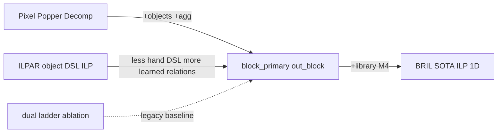

<!-- 92b02cc7-d643-4af0-99e8-6aa25e14953a -->
---
todos:
  - id: "write-sota-doc"
    content: "This file is the ILP landscape + BRIL target (was SOTA_ILP_METHOD)"
    status: completed
  - id: "link-solver-plan"
    content: "Cross-link SOLVER_PLAN ↔ CURRENT_METHOD ↔ this doc"
    status: completed
  - id: "upgrade-object-head"
    content: "Object-head out_block/5 (Bid,Off,Len,Color) — see CURRENT_METHOD.md"
    status: completed
  - id: "upgrade-library"
    content: "Cross-task library refinement (M4) with ablations — still future"
    status: pending
isProject: false
---
# ILP landscape + BRIL target for 1D-ARC

Scope: **ILP-only lineage** (no LLM program search, no pure neural TTT). Compare
the dual-ladder design in [SOLVER_PLAN.md](SOLVER_PLAN.md) and the as-built
block-primary stack in [CURRENT_METHOD.md](CURRENT_METHOD.md) to recent ILP work,
then state the long-term **BRIL** target. Normative direction:
[`.cursor/rules/block-level-only.mdc`](../.cursor/rules/block-level-only.mdc).

---

## 1. What recent ILP work actually did

### A. Relational Decomposition + Popper (Hocquette & Cropper, IJCAI 2025)
- **Idea:** Decompose I/O into facts; learn `out(...)` from `in(...)` with off-the-shelf Popper.
- **1D-ARC BK:** pixels + `empty` + arithmetic (`succ`, `lt`, `add`); deliberately **no** object operators.
- **Result:** ~59/63/69% at 1/10/60 min on 1D-ARC (vs ARGA ~94% with object DSL).
- **Strengths:** Domain-light; transferable across strings/lists/ARC; strong scientific control; interpretable clauses; exact few-shot induction.
- **Weaknesses:** Pixel BK forces long clauses; cannot invent counting/aggregation under timeout; loses badly to object-centric search on 1D-ARC; no cross-task library.

### B. ILPAR — ILP over object DSL (Rocha et al., 2024/2025)
- **Idea:** Cast ARC as a **sequence of ILP tasks** that **generate output objects** into an empty grid, using a hand-designed object-centric DSL as BK.
- **Strengths:** Objects-first (aligns with what humans/ARGA use); FOL is a natural language for relations; programs compose as object generators rather than only pixel painters; explicitly criticizes pixel-Popper as “very limiting.”
- **Weaknesses:** Small fixed DSL → only a curated task subset; heavy developer prior; not evaluated as a full 1D-ARC (900-instance) competitor; multi-ILP sequencing adds engineering complexity; risk of DSL incompleteness (Chollet’s “developer-aware generalization” trap).

### C. Earlier / adjacent symbolic baselines (context, not pure ILP)
- **ARGA (Xu et al., AAAI 2023):** Graph objects + constraint-guided DSL search — **94% on 1D-ARC**. Not ILP, but the performance ceiling object-centric methods set.
- **Paper’s own undecomposed ILP baselines:** ~0% on 1D-ARC — shows representation, not Popper itself, is the bottleneck.

### D. This repo (SOLVER_PLAN design → CURRENT_METHOD as-built)
- **Idea:** Per-instance Popper; deterministic color-block facts; precompute aggregations ILP cannot invent; exact train verification; optional color canonicalization.
- **As-built default:** `block_primary` — single mechanical object bias; head
  `out_block(Ex, Bid, Off, Len, Color)`; paint-verify; decode to pixels.
- **Legacy in code:** dual pixel+block ladder and trivials as **ablations only**.
- **Strengths vs A:** Objects + counting while staying ILP. vs B: Prefer **learned
  relations over blocks** to hand-coded transform operators; uniform language
  (no category-named DSL stages). vs ARGA: Keeps general ILP inducer; programs
  remain logical theories.
- **Remaining gaps:** Still **no library learning** across instances; hard
  categories (hollow / pcopy / flip / mirror) under **uniform** language; block
  definition is a single prior (maximal same-color run).

---

## 2. Strength / weakness matrix (ILP line)

| Method | Representation | What ILP learns | Prior in BK | 1D-ARC evidence | Main gap |
|--------|----------------|-----------------|-------------|-----------------|----------|
| Pixel relational decomp | pixels | `out` pixel rules | arithmetic only | 69% @1h | no objects/count |
| ILPAR | objects + DSL | object-generating LPs (sequenced) | rich object DSL | few curated ARC tasks | DSL completeness; scale |
| SOLVER_PLAN (design) | pixels + blocks + aggs | dual portfolio | segmentation + aggs | dual ladder ablations | dual as default is outdated |
| **CURRENT_METHOD** | lean blocks + aggs | `out_block/5` | mechanical allowlist + arith sugar | harness `block_primary` | hard cats under uniform lang; no library |
| SOTA target (below) | multi-view objects + roles | object (+ pixel ablation) rules; reusable preds | soft core priors only | aim ≥ ARGA on 1D, ILP-native | library + falsifiable ablations |

---

## 3. Proposed SOTA method (ILP-native) — **Block-Relational ILP with Library Refinement (BRIL)**

**One-sentence claim:** Beat object-centric search on 1D-ARC by combining ILPAR’s object-generation mindset with Hocquette-style off-the-shelf Popper, block representation from CURRENT_METHOD, and DreamCoder-like **ILP library refinement** — without shipping geometric transform operators.

### M1 — Multi-view perception (fixed, deterministic)
Encode every grid as:
1. **Blocks** = maximal same-color runs + derived geometry/aggregates (lean allowlist on `block_primary`)
2. **Roles** = typed size/value/block_id atoms; optional color canonicalization for ablations
3. **Pixels** = available for **ablation** baselines (`pixel_only` / dual), not required for the block claim

No ARGA-style operators (`mirror`, `denoise`, …) and no marker/reflect answer BK.

### M2 — Induction target — **object head done**
- **Object head (default):**  
  `out_block(Ex, Bid, Off, Len, Color) :- ...`  
  paint at `start(Bid)+Off` for `Len` cells of `Color`.
- **Pixel head:** `out(Ex,Pos,Color)` — ablation / legacy dual only.

This is the ILPAR insight (generate objects) without a hand DSL of transforms.

### M3 — Bias control (uniform, not category-staged)
Use **one mechanical bias generator** per instance (`render_object_bias_from_bk`)
with connectivity guards. Ordered **uniform** constraint tightening (clause/var
budgets, allowlist subsets derived from BK presence) is allowed; **category-named
stages** (`object_mirror`, …) are not — see the block-level-only rule.

Legacy dual ladder (trivials → block → object → pixel → dual) remains ablation-only.

### M4 — Cross-task library learning (the SOTA differentiator) — **future**
After each **verified** solve, compress recurring clause patterns into **named BK predicates** (predicate invention / anti-unification over successful programs), promoted only if:
- used in ≥K distinct task types, and
- re-solving those tasks with the library **does not** regress train verification.

Library is **OFF** for “paper-comparable single-instance” runs; **ON** for “generic improving solver” runs.

### M5 — Verification is the only teacher
Exact train-grid match (paint-verify on object path) remains the accept/reject criterion. Failed library candidates are rolled back. No LLM in the loop for the core claim.

### M6 — Evaluation (must report)
On full 1D-ARC 18×50:
- vs pixel Popper (69%), vs ARGA (94%), vs `block_primary` without library
- ablations: `pixel_only` / no-aggs / no-object-head / dual\* / library-on
- per-type solve rates

**Success criterion for “SOTA ILP on 1D-ARC”:** match or exceed ARGA aggregate **without** transform operators in BK, with interpretable Popper programs; show library-on improves hard types without hurting easy ones.

---

## 4. How this relates to implementation

| Piece | Maps to BRIL | Status |
|-------|--------------|--------|
| Lean block encode + aggs | M1 | Done (`block_primary`) |
| `out_block/5` + paint decode | M2 object head | **Done** |
| Mechanical bias + guards | M3 | Done |
| Dual / pixel ladder | ablation baseline | In code; not block claim |
| Color canonicalization | M1 roles (optional) | Ablation (`dual_full`) |
| Harness ablations | M6 | Done |
| Library learning | M4 | **Future** |

**Build order (updated):** object-primary is **current**. Dual ladder is an
ablation baseline for pixel comparison, **not** a prerequisite for the block
claim. Next SOTA upgrade is library refinement (M4), plus pushing hard
categories under the same uniform language — not “add object-head.”

---

## 5. Deliverable note

This file holds the comparison (§1–2) and BRIL method (§3–4). Living as-built
detail lives in [CURRENT_METHOD.md](CURRENT_METHOD.md); historical dual-ladder
prose in [SOLVER_PLAN.md](SOLVER_PLAN.md).
