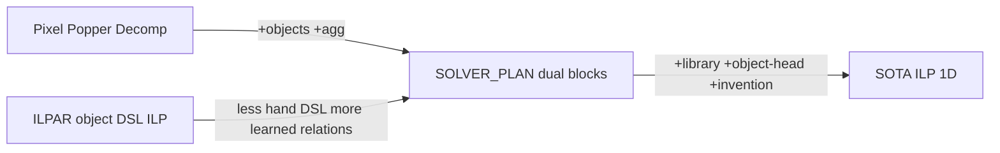

<!-- 92b02cc7-d643-4af0-99e8-6aa25e14953a -->
---
todos:
  - id: "write-sota-doc"
    content: "Write docs/SOTA_ILP_METHOD.md: ILP comparison + BRIL method"
    status: pending
  - id: "link-solver-plan"
    content: "Add pointer from SOLVER_PLAN.md to SOTA_ILP_METHOD.md"
    status: pending
  - id: "upgrade-object-head"
    content: "After dual+ladder works: add object-head ILP level (M2)"
    status: pending
  - id: "upgrade-library"
    content: "After object-head: add cross-task library refinement (M4) with ablations"
    status: pending
isProject: false
---
# SOTA ILP Method for Generic 1D-ARC

> **Note:** The as-built research path is object-only `block_primary`
> ([CURRENT_METHOD.md](CURRENT_METHOD.md)). This document remains the ILP
> landscape / thesis sketch; dual-ladder build order below is outdated.

Scope: **ILP-only lineage** (no LLM program search, no pure neural TTT). Compare [docs/SOLVER_PLAN.md](SOLVER_PLAN.md) to recent ILP work, then propose the research method that should become the long-term target.

---

## 1. What recent ILP work actually did

### A. Relational Decomposition + Popper (Hocquette & Cropper, IJCAI 2025)
- **Idea:** Decompose I/O into facts; learn `out(...)` from `in(...)` with off-the-shelf Popper.
- **1D-ARC BK:** pixels + `empty` + arithmetic (`succ`, `lt`, `add`); deliberately **no** object operators.
- **Result:** ~59/63/69% at 1/10/60 min on 1D-ARC (vs ARGA ~94% with object DSL).
- **Strengths:** Domain-light; transferable across strings/lists/ARC; strong scientific control; interpretable clauses; exact few-shot induction.
- **Weaknesses:** Pixel BK forces long clauses; cannot invent counting/aggregation under timeout; loses badly to object-centric search on 1D-ARC; no cross-task library.

### B. ILPAR — ILP over object DSL (Rocha et al., 2024/2025)
- **Idea:** Cast ARC as a **sequence of ILP tasks** that **generate output objects** into an empty grid, using a hand-designed object-centric DSL as BK.
- **Strengths:** Objects-first (aligns with what humans/ARGA use); FOL is a natural language for relations; programs compose as object generators rather than only pixel painters; explicitly criticizes pixel-Popper as “very limiting.”
- **Weaknesses:** Small fixed DSL → only a curated task subset; heavy developer prior; not evaluated as a full 1D-ARC (900-instance) competitor; multi-ILP sequencing adds engineering complexity; risk of DSL incompleteness (Chollet’s “developer-aware generalization” trap).

### C. Earlier / adjacent symbolic baselines (context, not pure ILP)
- **ARGA (Xu et al., AAAI 2023):** Graph objects + constraint-guided DSL search — **94% on 1D-ARC**. Not ILP, but the performance ceiling object-centric methods set.
- **Paper’s own undecomposed ILP baselines:** ~0% on 1D-ARC — shows representation, not Popper itself, is the bottleneck.

### D. Your SOLVER_PLAN.md (proposed)
- **Idea:** Per-instance Popper; **dual** pixel + **deterministic color-block** facts; precompute aggregations ILP cannot invent; cheap-first ladder; exact train verification; optional color canonicalization.
- **Strengths vs A:** Fixes the main failure mode (objects + counting) while staying ILP. vs B: Prefer **learned relations over blocks** to hand-coded transform operators; dual layer covers sub-object tasks; full-benchmark + ablation design. vs ARGA: Keeps general ILP inducer; programs remain logical theories.
- **Weaknesses vs SOTA need:** Still **no library learning** across instances; output is still pixel-head only (ILPAR’s object-generation framing may be more natural for fill/move); block definition is a single prior (maximal same-color run); ladder is heuristic, not theory-guided; no predicate invention / metarules beyond Popper defaults.

---

## 2. Strength / weakness matrix (ILP line)

| Method | Representation | What ILP learns | Prior in BK | 1D-ARC evidence | Main gap |
|--------|----------------|-----------------|-------------|-----------------|----------|
| Pixel relational decomp | pixels | `out` pixel rules | arithmetic only | 69% @1h | no objects/count |
| ILPAR | objects + DSL | object-generating LPs (sequenced) | rich object DSL | few curated ARC tasks | DSL completeness; scale |
| SOLVER_PLAN | pixels + blocks + aggs | `out` over dual BK | segmentation + aggs (no transform ops) | not yet run | no transfer/library; pixel head |
| SOTA target (below) | multi-view objects + roles | object + pixel rules; reusable preds | soft core priors only | aim ≥ ARGA on 1D, ILP-native | must stay falsifiable via ablations |

---

## 3. Proposed SOTA method (ILP-native) — **Block-Relational ILP with Library Refinement (BRIL)**

**One-sentence claim:** Beat object-centric search on 1D-ARC by combining ILPAR’s object-generation mindset with Hocquette-style off-the-shelf Popper, dual representation from SOLVER_PLAN, and DreamCoder-like **ILP library refinement** — without shipping geometric transform operators.

### M1 — Multi-view perception (fixed, deterministic)
Encode every grid as:
1. **Pixels** (`in`, `empty`, `width`)
2. **Blocks** = maximal same-color runs + derived geometry/aggregates (as in SOLVER_PLAN)
3. **Roles** = per-example color/size ranks (`majority_color`, `len_rank`, …) for cross-example binding

No ARGA-style operators (`mirror`, `denoise`, …) in BK.

### M2 — Dual induction targets (merge A + B)
Run **two ILP problems** per instance (same BK), accept if either (or their composition) verifies on all trains:

- **Pixel head:** `out(Ex,Pos,Color)` + bridges (`span`, `span_shift`) — covers denoise / OE recolor / stamping.
- **Object head:** learn generators such as  
  `out_block(Ex, Start, End, Color) :- ...`  
  then paint via BK bridge. Prefer object-head when block counts match across I/O (move/fill/hollow/recolor-by-size).

This is the ILPAR insight (generate objects) without requiring their full hand DSL of transforms.

### M3 — Metarules / bias portfolio (ILP search control)
Instead of only “bigger dual bias,” use a **ordered bias portfolio** (still Popper):
1. Trivial closed-form (identity, recolor bijection, shift-k, reverse) → emit as logic programs.
2. Object-head, short clauses, block+role preds only.
3. Pixel-head, block+pixel dual.
4. Pixel-head with higher `max_body` / recursion enabled if Popper settings allow.

Stop at first exact train verification (SOLVER_PLAN ladder, refined).

### M4 — Cross-task library learning (the SOTA differentiator)
After each **verified** solve, compress recurring clause patterns into **named BK predicates** (predicate invention / anti-unification over successful programs), e.g. `fill_between/3`, `shift_block/4`, promoted only if:
- used in ≥K distinct task types, and
- re-solving those tasks with the library **does not** regress train verification.

Library is **OFF** for “paper-comparable single-instance” runs; **ON** for “generic improving solver” runs. This directly answers the earlier question about reusing fill/reverse knowledge — but as **invented predicates**, not raw `program.pl` dumps.

### M5 — Verification is the only teacher
Exact train-grid match remains the accept/reject criterion (Hocquette + SOLVER_PLAN). Failed library candidates are rolled back. No LLM in the loop for the core claim (optional later as bias proposer only, outside ILP-SOTA claim).

### M6 — Evaluation (must report)
On full 1D-ARC 18×50:
- vs pixel Popper (69%), vs ARGA (94%), vs SOLVER_PLAN dual without library
- ablations: no-blocks / no-aggs / no-object-head / no-library / library-on
- per-type solve rates + which head/level/library hit

**Success criterion for “SOTA ILP on 1D-ARC”:** match or exceed ARGA aggregate **without** transform operators in BK, with interpretable Popper programs; show library-on improves hard types without hurting easy ones.

---

## 4. How this relates to SOLVER_PLAN implementation

| SOLVER_PLAN stage | Maps to BRIL |
|-------------------|--------------|
| Dual encode + aggs | M1 |
| Pixel `out` + bridges | M2 pixel head |
| Ladder | M3 (extend with object-head level) |
| Color canonicalization | M1 roles |
| Harness/ablations | M6 |
| Library (was “extension”) | **M4 becomes first-class for SOTA**, not optional afterthought |

**Build order recommendation:** implement SOLVER_PLAN commits 1–11 first (get dual+ladder numbers), then add object-head (M2) and library refinement (M4) as the SOTA upgrade commits.

---

## 5. Deliverable for this planning turn

Write method doc [`1d-arc/docs/SOTA_ILP_METHOD.md`](1d-arc/docs/SOTA_ILP_METHOD.md) containing the comparison (§1–2) and BRIL method (§3–4), and add a short pointer from `SOLVER_PLAN.md` → SOTA doc. No code changes in this step beyond docs when execution is approved.
